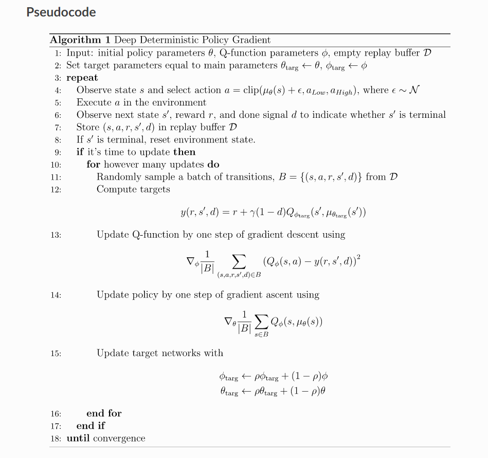
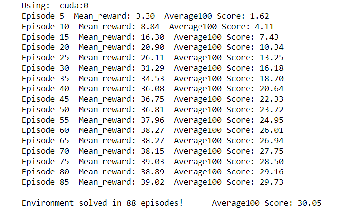
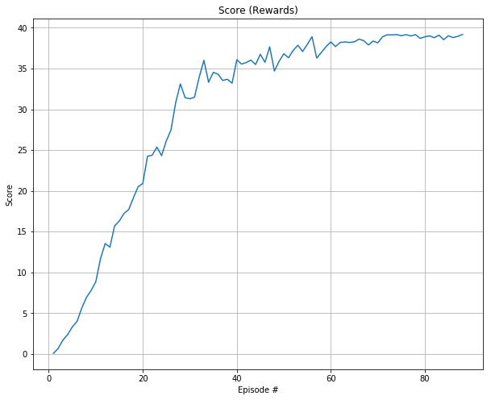

# Udacity Deep Reinforcement Learning Nanodegree
# Project 2: Continuous Control

As part of the [Udacity Deep Reinforcement Learning Nanodegree](https://www.udacity.com/course/deep-reinforcement-learning-nanodegree--nd893) here you can read the report of the Project 2: Continuous Control.

The challenge of this project is about training a double-jointed arm that can move to target locations. A reward of +0.1 is provided for each step that the agent's hand is in the goal location. Thus, the goal of the agent is to maintain its position at the target location for as many time steps as possible.


### The Environment

The environment is based on [Unity ML-agents](https://github.com/Unity-Technologies/ml-agents). Unity ML-Agents is an open-source Unity plugin that enables games and simulations to serve as environments for training intelligent agents.

**Note:** The Unity ML-Agent team frequently releases updated versions of their environment. In this repository, the v0.4 interface has been used. The project environment provided by Udacity is similar to, but not identical to the [Reacher](https://github.com/Unity-Technologies/ml-agents/blob/master/docs/Learning-Environment-Examples.md#reacher) environment on the Unity ML-Agents GitHub page.

The observation space consists of 33 variables corresponding to position, rotation, velocity, and angular velocities of the arm. Each action is a vector with four numbers, corresponding to torque applicable to two joints. Every entry in the action vector should be a number between -1 and 1.

There are two versions of the environment:

* **Version 1: One (1) Agent**  
The task is episodic, and in order to solve the environment, the agent must get an **average score of +30 over 100 consecutive episodes**.

* **Version 2: Twenty (20) Agents**  
The 20 agents must get an average score of +30 (over 100 consecutive episodes, and over all agents). 
At the end of each episode, the rewards that each agent received (without discounting) are added up. 
This generates 20 potentially different scores. Then the average of these 20 scores is taken, which is the average score for each episode (where the average is over all 20 agents).   
Finally the environment is considered solved when the **moving average over 100 episodes** of those average scores **is at least +30**.

In this repository, the second version of the environment has been used with a DDPG algorithm.

## Learning Algorithm

### Agent implementation: Deep Deterministic Policy Gradient (DDPG)

For this project I implemented an *off-policy method* called **Deep Deterministic Policy Gradient**, you can read more about it in this paper: [Continuous control with deep reinforcement learning](https://arxiv.org/abs/1509.02971). 

Deep Deterministic Policy Gradient (DDPG) is an algorithm which concurrently learns a Q-function and a policy. It uses off-policy data and the Bellman equation to learn the Q-function, and uses the Q-function to learn the policy.
It combines ideas from DPG (Deterministic Policy Gradient) and DQN (Deep Q-Network). It uses Experience Replay and slow-learning target networks from DQN, and it is based on DPG, which can operate over continuous action spaces.

By combining the actor-critic approach with the Deep Q Network method, the algorithm uses two networks:

- the **Actor** network, which proposes an action given a state
- the **Critic** network, which predicts if the action is good (positive value) or bad (negative value) given a state and an action.

These two networks are deployed alongside 2 more techniques:

- **2 Target networks**, which add stability to training by learning from estimated targets. The Target networks are updated slowly, hence keeping the estimated targets stable.
- **Experience Replay**, by storing list of tuples (state, action, reward, next_state), and instead of learning only from recent experience, the agent learns from sampling all of the experience accumulated so far.



## Code implementation

The code is organized in three files:

**model.py** 

This file contains the **Actor** and the **Critic** class and each of them are then used to implement a "Target" and a "Local" Neural Network for training/learning. 

Here are the Actor and Critic network architectures:

```
Actor NN(
  (fc1): Linear(in_features=33(state size), out_features=512, bias=True, Batch Normlization, relu activation)
  (fc2): Linear(in_features=512, out_features=256, bias=True, Batch Normlization, relu activation)
  (out): Linear(in_features=256, out_features=4(action size), bias=True, tanh activation)
)
```

```
Critic NN(
  (fc1): Linear(in_features=33(state size), out_features=486, bias=True, Batch Normlization, relu activation)
  (fc2): Linear(in_features=486+4(action size), out_features=256, bias=True, Batch Normlization, relu activation)
  (out): Linear(in_features=256, out_features=1, bias=True, no activation function)
)
```    

**ddpg_agent.py** 

Here you can find three classes: the (DDPG) Agent, the Noise and the Replay Buffer class.

The (DDPG) class Agent contains 5 methods:
- constructor, which initializes the memory buffer and two instances of both Actor's and Critic's NN (target and local).
- step(), which allows to store a step taken by the RL agent (state, action, reward, next_state, done) in the Replay Buffer/Memory. Every four steps, it updates the target NN weights  with the current weight values from the local NN (Fixed Q Targets technique)
- act(), which returns actions for given state as per current policy through an Epsilon-greedy selection in order to balance exploration and exploitation in the Q Learning process
- learn(), which updates value parameters using given batch of experience tuples in the form of (state, action, reward, next_state, done) 
- soft_update(), which is used by the learn() method to softly updates the target NN weights from the local NN weights for both Actor and Critic networks

The ReplayBuffer class consists of Fixed-size buffer to store experience tuples (state, action, reward, next_state, done)  and contains these methods:
- add(), which adds a new experience tuple to memory
- sample(), which randomly sample a batch of experiences from memory for the learning process of the agent
- len(), which returns the current size of internal memory

The OUNoise class implements a Ornstein-Uhlenbeck process.
This is inspired by the [DDPG paper](https://arxiv.org/abs/1509.02971), where the authors use an Ornstein-Uhlenbeck Process to add noise to the action output.
  
**Continuous_Control.ipynb**

This is the Jupyter notebook where I trained the agent. These are the steps taken in it:
  - Importing the necessary packages 
  - Examining the State and Action Spaces
  - Testing random actions in the Environment
  - Training a DDPG agent
  - Ploting the training scores 

### Hyperparameters

The DDPG agent uses the following hyperparameters:

```
BUFFER_SIZE = int(1e6)  # replay buffer size
BATCH_SIZE = 256        # minibatch size
GAMMA = 0.99            # discount factor
TAU = 1e-3              # for soft update of target parameters
LR_ACTOR = 1e-5         # learning rate of the actor 
LR_CRITIC = 1e-4        # learning rate of the critic
WEIGHT_DECAY = 0        # L2 weight decay
LEARN_EVERY = 20        # Update the networks 10 times after every 20 timesteps
LEARN_NUMBER = 10       # Update the networks 10 times after every 20 timesteps
EPSILON = 1.0           # Noise factor
EPSILON_DECAY = 0.999999  # Noise factor decay
```

## Results

Here is the evolution of the score per episodes:





After **88 episodes** the 100 period moving average (average over all 20 agents) reached a score of **30.05**, getting above the challenge's goal of at least +30.**


## Ideas for future work

Here are some ideas on further developments of the algorithm, beyond simply playing around with the presented architecture and hyperparameters tuning.

Other actor-critic algorithms proposed to solve this kind of environment can be found in these links:

[Distributed Distributional Deterministic Policy Gradients](https://openreview.net/pdf?id=SyZipzbCb)
> This work adopts the very successful distributional perspective on reinforcement learning and adapts it to the continuous control setting. We combine this within a distributed framework for off-policy learning in order to develop what we call the Distributed Distributional Deep Deterministic Policy Gradient algorithm, D4PG. We also combine this technique with a number of additional, simple improvements such as the use of N-step returns and prioritized experience replay. Experimentally we examine the contribution of each of these individual components, and show how they interact, as well as their combined contributions. Our results show that across a wide variety of simple control tasks, difficult manipulation tasks, and a set of hard obstacle-based locomotion tasks the D4PG algorithm achieves state of the art performance.

[Sample Efficient Actor-Critic with Experience Replay](https://arxiv.org/abs/1611.01224)
> This paper presents an actor-critic deep reinforcement learning agent with experience replay that is stable, sample efficient, and performs remarkably well on challenging environments, including the discrete 57-game Atari domain and several continuous control problems. To achieve this, the paper introduces several innovations, including truncated importance sampling with bias correction, stochastic dueling network architectures, and a new trust region policy optimization method.

[A2C - Asynchronous Methods for Deep Reinforcement Learning](https://arxiv.org/abs/1602.01783v2)
> A2C, or Advantage Actor Critic, is a synchronous version of the A3C policy gradient method. As an alternative to the asynchronous implementation of A3C, A2C is a synchronous, deterministic implementation that waits for each actor to finish its segment of experience before updating, averaging over all of the actors. This more effectively uses GPUs due to larger batch sizes.

[A3C - Asynchronous Methods for Deep Reinforcement Learning](https://arxiv.org/abs/1602.01783)
> We propose a conceptually simple and lightweight framework for deep reinforcement learning that uses asynchronous gradient descent for optimization of deep neural network controllers. We present asynchronous variants of four standard reinforcement learning algorithms and show that parallel actor-learners have a stabilizing effect on training allowing all four methods to successfully train neural network controllers. The best performing method, an asynchronous variant of actor-critic, surpasses the current state-of-the-art on the Atari domain while training for half the time on a single multi-core CPU instead of a GPU. Furthermore, we show that asynchronous actor-critic succeeds on a wide variety of continuous motor control problems as well as on a new task of navigating random 3D mazes using a visual input.
